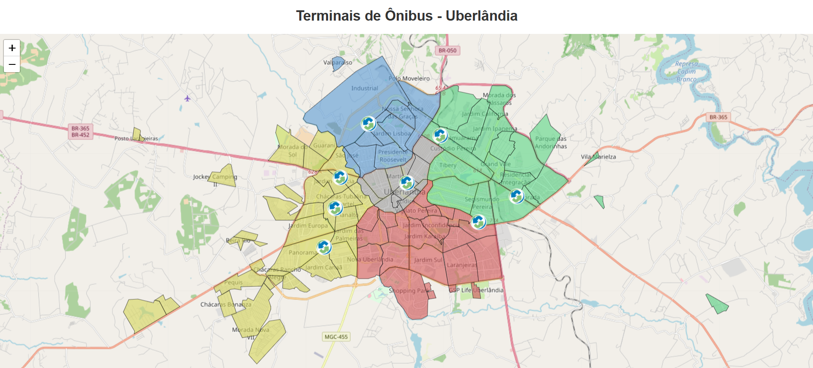
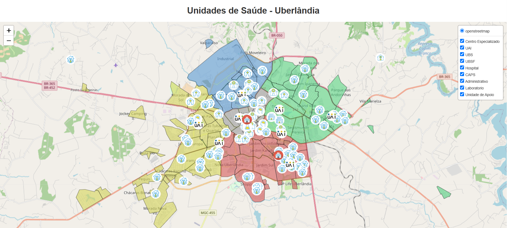

# 🗺️ Uberlândia GeoData

Este projeto combina **a criação manual de polígonos** para os bairros de Uberlândia (MG) com a geração de **mapas interativos** mostrando:
- Distribuição territorial dos bairros
- Localização dos Terminais Urbanos
- Localização das Unidades de Saúde Públicas

Além de construir os dados espaciais do zero, o projeto foca em técnicas de manipulação, reprojeção e visualização de dados geográficos em Python.

---

## 🎯 Objetivos

- Praticar a manipulação de dados espaciais em Python com **GeoPandas**, **Shapely** e **Folium**.
- Criar manualmente os contornos dos bairros via coordenadas geográficas (WKT).
- Classificar os bairros por zona territorial (Leste, Oeste, Norte, Sul, Central).
- Construir mapas interativos de análise territorial urbana.
- Visualizar e exportar os dados em formatos HTML (interativo) e PNG (estático).

> ℹ️ **Nota**: Embora existam ferramentas para obter polígonos automaticamente (como Overpass-turbo ou APIs do OpenStreetMap), neste projeto optamos pela criação manual dos bairros **para fins de estudo e prática de manipulação espacial em Python**.

---

### 📚 Tecnologias & Ferramentas


---

## 🌐 Mapas Gerados

- `📍 mapa_Uberlandia.html`: bairros coloridos por zona territorial
- `🚏 mapa_TerminaisUberlandia.html`: terminais de ônibus
- `🚧 mapa_TerminaisUberlandia-Projecao.html`: terminais de ônibus com terminal em construção
- `🏥 mapa_SaudeUberlandia.html`: unidades de saúde públicas da cidade

📁 **Arquivos HTML** estão na pasta `MapsHTML/`.  
📸 **Imagens capturadas** estão na pasta `MapsPNG/`.

### Exemplos de Mapas

<h5><center>Terminais de ônibus Uberlândia</center></h5>

<p align="center">
  </p>
  <h5><center>Unidades de saúde Uberlândia</center></h5>
<p align="center">  
  
</p>

---

## 🌍 Sobre a Reprojeção de Dados

As coordenadas foram desenhadas manualmente em EPSG:4326 (WGS84 - Latitude/Longitude).  
Para sobrepor corretamente nos tiles OpenStreetMap, os dados são reprojetados para EPSG:3857 (Web Mercator).

```python
gdf.set_crs(epsg=4326, inplace=True)
gdf = gdf.to_crs(epsg=3857)
``` 

---

## 📁 Estrutura de Pastas do Projeto

```
poligonos-bairros/
├── data/             # GeoJSON dos bairros
├── notebooks/        # Notebooks de criação e análise de mapas
├── output/           # Imagens .png temporárias
├── MapsHTML/         # Mapas interativos exportados em HTML
├── MapsPNG/          # Capturas de tela dos mapas
├── requirements.txt  # Dependências do projeto
├── readme.md         # Documentação principal
```

> ⚠️ Nota: todos os caminhos para leitura e escrita de arquivos são relativos.

---

## 🚀 Como executar o projeto

1. **Clone o repositório:**

```bash
git clone https://github.com/LeandroOrnelas/poligonos-bairros.git
cd poligonos-bairros
```

2. **Crie e ative o ambiente virtual (Windows):**

```bash
python -m venv venv
venv\Scripts\activate
```

3. **Instale as dependências:**

```bash
pip install -r requirements.txt
```

4. **Execute os notebooks:**

- `create-polygon.ipynb`: cria os polígonos dos bairros manualmente
- `explorer-maps-SIT.ipynb`: gera mapas de terminais urbanos
- `explorer-maps-SUS.ipynb`: gera mapas das unidades de saúde

---

## 📌 Sobre o Autor

Desenvolvido por **Leandro Ornelas**

<p align="center">
  <a href="https://github.com/LeandroOrnelas" title="GitHub">
    
  </a>
  <a href="mailto:leandro.nanndo@gmail.com" title="Gmail">
    
  </a>
  <a href="https://www.linkedin.com/in/leandroornelas/" title="LinkedIn">
    
  </a>
</p>


---
