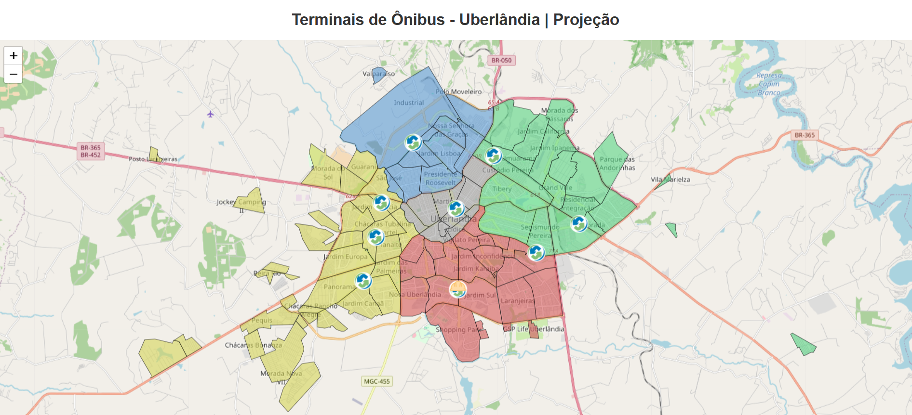

# 🗺️ Análise Espacial dos Bairros e Terminais de Ônibus de Uberlândia com Python

Este projeto vai além da criação manual de polígonos: ele explora também a distribuição de terminais de ônibus da cidade de Uberlândia, com visualizações interativas em HTML via Folium e exportação para PNG.

O foco principal é a **criação manual de polígonos** representando os bairros de Uberlândia (MG), com classificação por **zona territorial** (Leste, Oeste, Norte, Sul ou Central), e sua **plotagem sobre mapas base** usando o `contextily`.

---

## 🎯 Objetivos

- Praticar a manipulação de dados espaciais em Python com **GeoPandas** e **Shapely**.
- Criar manualmente os contornos dos bairros via coordenadas geográficas (WKT).
- Classificar os bairros por zona territorial.
- Visualizar os dados em um mapa com **tiles do OpenStreetMap**.

---

## 🧰 Tecnologias e Bibliotecas Utilizadas

- **Python 3**
- [GeoPandas](https://geopandas.org/)
- [Shapely](https://shapely.readthedocs.io/)
- [Contextily](https://contextily.readthedocs.io/)
- [Matplotlib](https://matplotlib.org/)

---

## 🌐 Mapas Interativos

Os seguintes mapas estão disponíveis:

- `📍 mapa_Uberlandia.html`: bairros coloridos por zona territorial
- `🚏 mapa_terminais.html`: terminais de ônibus atuais
- `🚧 mapa_obras.html`: terminais de ônibus atuais + terminal universitário em construção

📁 Acesse os arquivos na pasta `MapsHTML/`.

📸 Capturas de tela disponíveis em `MapsPNG/` para visualização rápida.


<h5><center>Demostração de um dos mapas</center></h5>


<p align="center">
  
</p>


---


## 🌍 Sobre a Reprojeção

As coordenadas foram definidas manualmente em latitude/longitude (EPSG:4326 - WGS84). Para que os polígonos se alinhem corretamente com mapas base (como OpenStreetMap), é necessário reprojetar os dados para o sistema EPSG:3857 (Web Mercator).

ℹ️ A conversão correta é feita com:

```python
gdf.set_crs(epsg=4326, inplace=True)  # Define o CRS original
gdf = gdf.to_crs(epsg=3857)           # Converte para Web Mercator
``` 

---

## 📁 Estrutura de Pastas do Projeto

Abaixo está a organização adotada para manter o projeto modular e limpo:

```
poligonos-bairros/
├── data/             # GeoJSON dos bairros
├── notebooks/        # Jupyter Notebooks do projeto
├── output/           # Imagens .png temporárias
├── MapsHTML/         # Mapas interativos exportados em HTML
├── MapsPNG/          # Capturas de tela dos mapas
├── requirements.txt
```

> ⚠️ Observação: os notebooks devem sempre considerar os caminhos relativos para salvar arquivos, como `../data/arquivo.geojson` ou `../output/mapa.png`.

---

## 🚀 Como executar o projeto

1. **Clone o repositório:**

```bash
git clone https://github.com/LeandroOrnelas/poligonos-bairros.git
cd poligonos-bairros
```

2. **Crie e ative o ambiente virtual (Windows):**

```bash
python -m venv venv
venv\Scripts\activate
```

3. **Instale as dependências:**

```bash
pip install -r requirements.txt
```

4. **Execute o notebook:**

Abra o arquivo `notebooks/create-polygon.ipynb` no Jupyter ou VS Code e rode as células.

📦 Os arquivos de saída serão gerados nas pastas:
- `data/` → arquivos `.geojson`
- `MapsHTML/` → imagens `.html`

---

## 📌 Autor

Desenvolvido por **Leandro Ornelas**

[](https://github.com/LeandroOrnelas)
<p align="left">
  <a href="mailto:leandro.nanndo@gmail.com" title="Gmail">
    
  </a>
  <a href="https://www.linkedin.com/in/leandroornelas/" title="LinkedIn">
    
  </a>
  <a href="https://api.whatsapp.com/send?phone=5534991949009" title="WhatsApp">
    
  </a>
</p>


